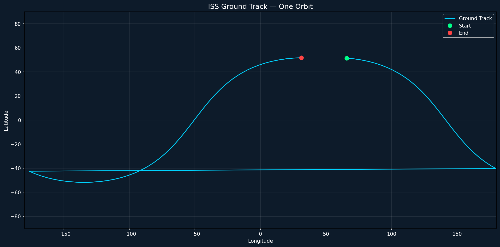

# orbit-lab

A Python-based SGP4 orbital propagator that computes and visualizes satellite ground tracks from Two-Line Element (TLE) data.

Built as a GNC learning project and aerospace portfolio piece.



---

## What It Does

- Parses Two-Line Element (TLE) sets into structured Python objects
- Propagates satellite positions using the SGP4 algorithm
- Converts ECI coordinates to latitude, longitude, and altitude
- Visualizes ground tracks on a world map

---

## The Pipeline
```
TLE string
    ↓
parse_tle()         →  TLE object
    ↓
propagate()         →  ECI position vectors (km)
    ↓
eci_to_lla()        →  Latitude, Longitude, Altitude
    ↓
plot_ground_track() →  Ground track visualization
```

---

## Concepts

**Two-Line Element (TLE):** A standardized format for describing a satellite orbit at a specific epoch. Published by Space-Track for every tracked object in Earth orbit.

**SGP4:** Simplified General Perturbations 4 — the industry-standard algorithm for propagating satellite positions from TLE data. Accounts for atmospheric drag, Earth's oblateness, and other perturbations.

**ECI (Earth-Centered Inertial):** A coordinate frame centered at Earth's center with axes fixed to distant stars. Used for orbital math.

**GST (Greenwich Sidereal Time):** The rotation angle of the Earth at a given moment. Used to convert ECI coordinates to Earth-fixed latitude and longitude.

---

## Project Structure
```
orbit-lab/
├── src/
│   ├── tle_parser.py      # TLE parsing and data structure
│   ├── propagator.py      # SGP4 propagation
│   ├── transforms.py      # ECI to LLA coordinate transform
│   └── visualizer.py      # Ground track plotting
├── tests/
│   └── test_tle_parser.py # Unit tests
├── docs/
│   └── ground_track.png   # Sample output
├── requirements.txt
└── README.md
```

---

## Getting Started

**Clone the repo:**
```bash
git clone https://github.com/YOUR_USERNAME/orbit-lab.git
cd orbit-lab
```

**Create and activate a virtual environment:**
```bash
python -m venv venv
venv\\Scripts\\Activate.ps1  # Windows
source venv/bin/activate       # macOS/Linux
```

**Install dependencies:**
```bash
pip install -r requirements.txt
```

**Run the visualizer:**
```bash
python src/visualizer.py
```

**Run the tests:**
```bash
pytest tests/
```

---

## Dependencies

- [sgp4](https://github.com/brandon-rhodes/python-sgp4) — SGP4 propagation
- [numpy](https://numpy.org/) — Numerical computing
- [matplotlib](https://matplotlib.org/) — Visualization
- [pytest](https://pytest.org/) — Testing

---

## Roadmap

- [x] TLE parser
- [x] SGP4 propagation
- [x] ECI to LLA coordinate transform
- [x] Ground track visualization
- [ ] Multi-orbit ground track
- [ ] 3D orbit visualization
- [ ] Live TLE fetch from Space-Track API
- [ ] Streamlit interactive demo

---

## Author

Jose | Spacecraft Systems & Software Engineer  
[GitHub](https://github.com/jacastor) · [LinkedIn](https://www.linkedin.com/in/jose-castro-783a9a13b/)

---

## License

MIT
